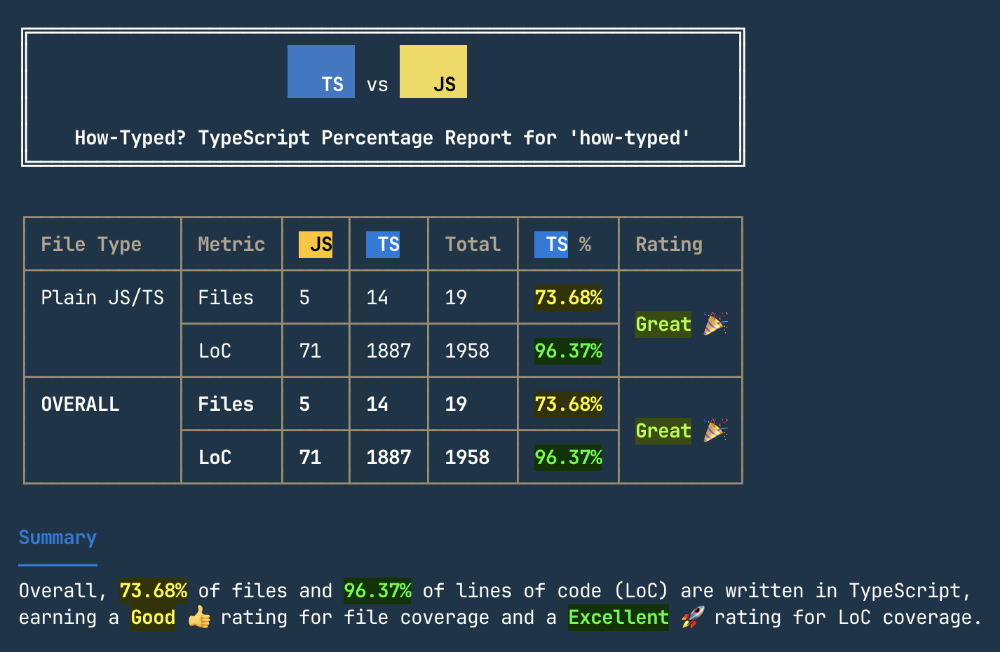

<h1 align="center">
  🤔 How-Typed?
</h1>

<h3 align="center">How Typed Is Your Code? Discover Your Project’s TypeScript Coverage with How-Typed!</h3>

<p align="center">
  🚀 Instant TypeScript vs. JavaScript Breakdown ⋅ 👥 Great for Team Projects ⋅ 📈 Track Your TypeScript Adoption Progress ⋅ 🪶 Simple and Lightweight CLI Tool
</p>

---

**How-Typed?** calculates and outputs TypeScript metrics for a given directory. It counts the number of JavaScript, TypeScript files, and generates a report with the coverage percentage and color-coded messages.

- 🔍 Scan your codebase quickly to see the exact split between TypeScript and JavaScript.
- 👀 Monitor TypeScript usage over time and see how close you are to full coverage.
- 🧑‍💻Easily integrate How-Typed into your workflow without impacting performance.
- 👥 Perfect for shared codebases - get insights on how typed your project is and improve overall consistency.

## Table of Contents <!-- omit from toc -->

- [📜 Languages Supported](#-languages-supported)
- [🏃 Usage](#-usage)
  - [Running](#running)
  - [:gear: CLI Options](#gear-cli-options)
  - [Installation](#installation)
- [📝 Example Output](#-example-output)

---

## 📜 Languages Supported

- TypeScript (`.ts`, `.tsx`)
- JavaScript (`.js`, `.mjs`, `.cjs`, `.jsx`)
- Vue SFCs (`.vue`)

## 🏃 Usage

### Running

You can run the tool using [npx](https://docs.npmjs.com/cli/v8/commands/npx):

```sh
npx how-typed [directory] # if no directory specified, analysis will be run against current working directory

# e.g.
npx how-typed ./
```

### :gear: CLI Options

| Option | Required   | Default | Description |
| ------ | :--------: | ------- | ----------- |
| `--json`| - | `false` | Whether to output the report as raw JSON |
| `-h`, `--help` | - | - | Prints help information |
| `-v`, `--version` | - | - | Output the current version |

### Installation

You can install the tool globally which will give access to the `how-typed` command:

```sh
# Install globally
npm install -g how-typed

# Run the command
how-typed [directory]

# e.g.
how-typed ./
```

## 📝 Example Output


